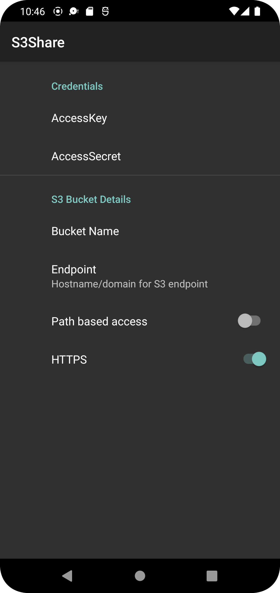
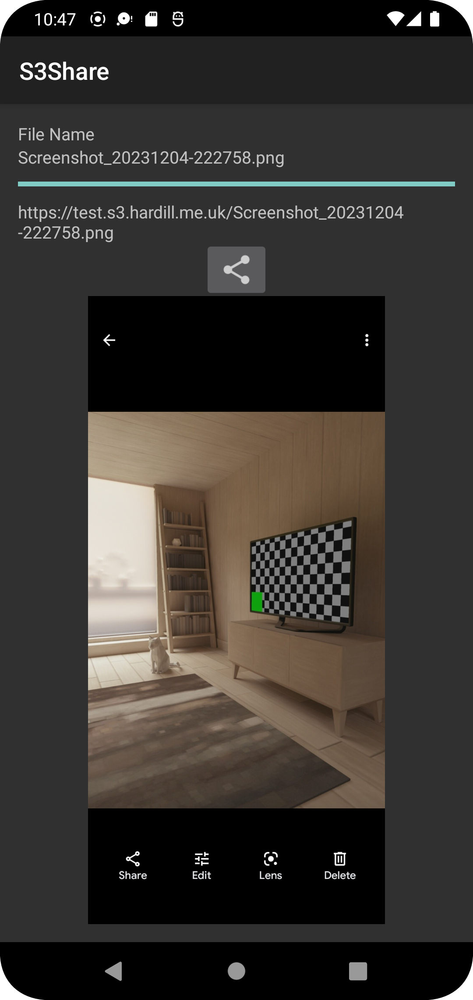

# S3Share
A simple Android app to allow the sharing of images and videos to S3 Buckets

## Configuration
Launching the app will present a preferences screen to enter the following:

 - Access Key - AWS Access Key
 - Access Secret - AWS Access Secret
 - Bucket Name - name of the S3 Bucket
 - Endpoint - The hostname or domain that the bucket is hosted on
 - Path based access - Path based access or Hostname based access
 - HTTPS - Use HTTPS or not

## Using
To use just hit the share button in any of your apps that creates images or videos.
In the popup that appears there should be a S3Share icon. Selecting this will open
the S3Share Activity which will show progress of the upload and when complete allow
you to copy the URL that points to the item in the bucket.

